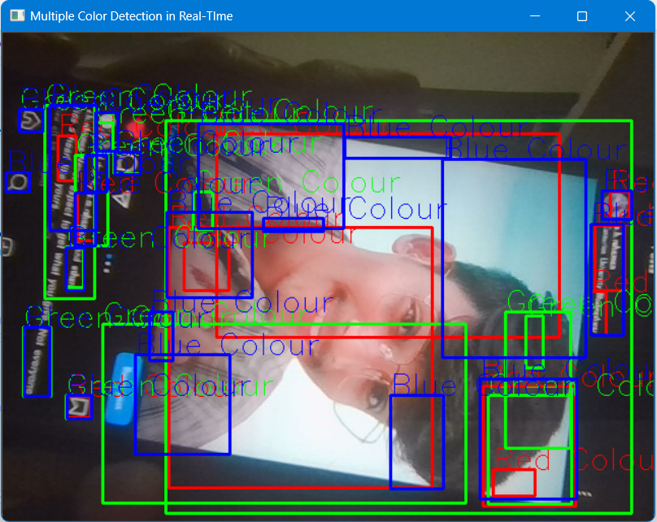

# Mutli Color Detection (Video Processing)
The Multi Color Detection program is a computer vision application that utilizes OpenCV to detect RGB colors within different boxes or regions of interest (ROIs). This program provides an efficient and automated way to identify and analyze specific colors in images or video streams.

Project - 10

## Table of Contents

- [Installation](#installation)
- [Contributing](#contributing)
- [Feedback and Suggestions](#feedback-and-suggestions)
## Installation

 1. Clone the repository
 2. Install the required libraries
 3. Run the code ( Make sure you must have videocam) 

## Contributing

Contributions are welcome! If you'd like to contribute to this project, please follow these steps:

 1. Fork the repository
 2. Create a new branch
 3. Push to the branch

## Feedback and Suggestions

If you have any feedback or suggestions for improving this model, please feel free to reach out to me. You can contact me via email at s.h.rehaman.art@gmail.com or through WhatsApp at [Just Say Hello 👋 ](https://api.whatsapp.com/send/?phone=919777795786&text=Hello%20Shaikh%20Habibur%20Rehaman,%20I%20get%20this%20no.%20from%20your%20Github%20&type=phone_number&app_absent=0)
